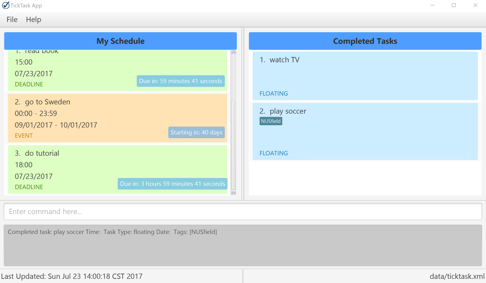

= TickTask
ifdef::env-github,env-browser[:relfileprefix: docs/]
ifdef::env-github,env-browser[:outfilesuffix: .adoc]

https://travis-ci.org/CS2103JUN2017-T1/main/tree/V0.4-Working-Version[image:https://travis-ci.org/CS2103JUN2017-T1/main/tree/V0.4-Working-Version[Build Status]]
https://coveralls.io/github/CS2103JUN2017-T1/main/tree/V0.4-Working-Version[image:https://coveralls.io/repos/github/CS2103JUN2017-T1/main/tree/V0.4-Working-Version[Coverage Status]]
https://www.codacy.com/app/CS2103JUN2017-T1/main/tree/V0.4-Working-Version&utm_campaign=Badge_Grade[image:https://api.codacy.com/project/badge/Grade/fc0b7775cf7f4fdeaf08776f3d8e364a[Codacy Badge]]

ifdef::env-github[]

endif::[]

ifndef::env-github[]
image::images/Ui.png[width="600"]
endif::[]

* This is a desktop TickTask task manager application. It has a GUI but most of the user interactions happen using a CLI (Command Line Interface).
* It is a Java sample application intended for students learning Software Engineering while using Java as the main programming language.
* This program utilises the command line interface to allow users to manage their schedule and tasks. 

== Site Map

* <<UserGuide#, User Guide>>
* <<DeveloperGuide#, Developer Guide>>
* <<LearningOutcomes#, Learning Outcomes>>
* <<AboutUs#, About Us>>
* <<ContactUs#, Contact Us>>

== Acknowledgements

* Some parts of this sample application were inspired by the excellent http://code.makery.ch/library/javafx-8-tutorial/[Java FX tutorial] by
_Marco Jakob_.

== Licence : link:LICENSE[MIT]
