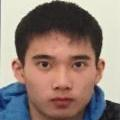
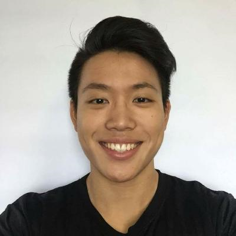
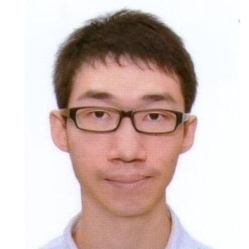

# About Us
We are a team Engineering students based in the [School of Computing, National University of Singapore](http://www.comp.nus.edu.sg)
## Project Team
#### [Lui Sheng Jie](https://github.com/luishengjie)  
 
**Role**: Team Leader  
**Responsibilities**: Project Coordination & Development  
**Components in charge of:** Logic & Model 
**Features implemented:**
* Add Command
* Mark/Unmark Command
* Clear Command
* Parse DateTime

**Code Written:** 
**Other major contributions:** 

-----

#### [Li Shi Cheng](https://github.com/Li-Shicheng)
 
**Role:** Developer  
**Components in charge of:** Logic 
**Features implemented:** 
**Code Written:** 
**Other major contributions:**

-----
#### [Lim Dao Han](http://github.com/)
 
**Role:** Developer  
**Components in charge of:** Storage & Google Calendar 
**Features implemented:** 
**Code Written:** 
**Other major contributions:**

-----
#### [Tay Chi Shien](https://github.com/chishien)
 
**Role:** Developer  
**Components in charge of:** Logic 
**Features implemented:** 
**Code Written:** 
**Other major contributions:**

-----
#### [Aung Swumm Htet Pyi Aye](https://github.com/ashpa)
 
**Role:** Developer  
**Components in charge of:** Ui & Ux 
**Features implemented:** 
**Code Written:** 
**Other major contributions:**

-----
# Contributors
We welcome contributions. See [Contact Us](ContactUs.md) page for more info.
