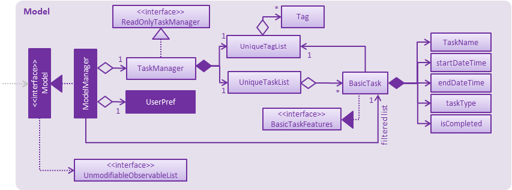

# whatsNext(Task Manager Application) - Developer Guide

By: T01-T4		Since: Jun 2017		License: MIT

---

## 1. Setting up

### 1.1. Prerequisites

1. **JDK `1.8.0_131`**  or later 

    > Having any Java 8 version is not enough.  
    This app will not work with earlier versions of Java 8.

2. **Eclipse** IDE
3. **e(fx)clipse** plugin for Eclipse (Do the steps 2 onwards given in
   [this page](http://www.eclipse.org/efxclipse/install.html#for-the-ambitious))
4. **Buildship Gradle Integration** plugin from the Eclipse Marketplace
5. **Checkstyle Plug-in** plugin from the Eclipse Marketplace

### 1.2. Importing the project into Eclipse

0. Fork this repo, and clone the fork to your computer
1. Open Eclipse (Note: Ensure you have installed the **e(fx)clipse** and **buildship** plugins as given in the prerequisites above)
2. Click `File` > `Import`
3. Click `Gradle` > `Gradle Project` > `Next` > `Next`
4. Click `Browse`, then locate the project's directory
5. Click `Finish`

  > * If you are asked whether to 'keep' or 'overwrite' config files, choose to 'keep'.
  > * Depending on your connection speed and server load, it can even take up to 30 minutes for the set up to finish
      (This is because Gradle downloads library files from servers during the project set up process)
  > * If Eclipse auto-changed any settings files during the import process, you can discard those changes.

### 1.3. Configuring Checkstyle
1. Click `Project` -> `Properties` -> `Checkstyle` -> `Local Check Configurations` -> `New...`
2. Choose `External Configuration File` under `Type`
3. Enter an arbitrary configuration name e.g. addressbook
4. Import checkstyle configuration file found at `config/checkstyle/checkstyle.xml`
5. Click OK once, go to the `Main` tab, use the newly imported check configuration.
6. Tick and select `files from packages`, click `Change...`, and select the `resources` package
7. Click OK twice. Rebuild project if prompted

> Note to click on the `files from packages` text after ticking in order to enable the `Change...` button

### 1.4. Troubleshooting project setup

**Problem: Eclipse reports compile errors after new commits are pulled from Git**

* Reason: Eclipse fails to recognize new files that appeared due to the Git pull.
* Solution: Refresh the project in Eclipse: 
  Right click on the project (in Eclipse package explorer), choose `Gradle` -> `Refresh Gradle Project`.

**Problem: Eclipse reports some required libraries missing**

* Reason: Required libraries may not have been downloaded during the project import.
* Solution: [Run tests using Gradle](UsingGradle.md) once (to refresh the libraries).

## 2. Design

### 2.1. Architecture

Author: {To be added} {To be added}

 
_Figure 2.1.1 : Architecture Diagram_

The **_Architecture Diagram_** given above explains the high-level design of the App.
Given below is a quick overview of each component.

> Tip: The `.pptx` files used to create diagrams in this document can be found in the [diagrams](diagrams/) folder.
> To update a diagram, modify the diagram in the pptx file, select the objects of the diagram, and choose `Save as picture`.

`Main` has only one class called [`MainApp`](../src/main/java/seedu/address/MainApp.java). It is responsible for,

* At app launch: Initializes the components in the correct sequence, and connects them up with each other.
* At shut down: Shuts down the components and invokes cleanup method where necessary.

[**`Commons`**] represents a collection of classes used by multiple other components.
Two of those classes play important roles at the architecture level.

* `EventsCenter` : This class (written using [Google's Event Bus library](https://github.com/google/guava/wiki/EventBusExplained))
  is used by components to communicate with other components using events (i.e. a form of _Event Driven_ design)
* `LogsCenter` : Used by many classes to write log messages to the App's log file.

The rest of the App consists of four components.

* [**`UI`**] : The UI of the App.
* [**`Logic`**] : The command executor.
* [**`Model`**]: Holds the data of the App in-memory.
* [**`Storage`**] : Reads data from, and writes data to, the hard disk.

Each of the four components

* Defines its _API_ in an `interface` with the same name as the Component.
* Exposes its functionality using a `{Component Name}Manager` class.

For example, the `Logic` component (see the class diagram given below) defines it's API in the `Logic.java`
interface and exposes its functionality using the `LogicManager.java` class. 
 
_Figure 2.1.2 : Class Diagram of the Logic Component_

#### Events-Driven nature of the design

The _Sequence Diagram_ below shows how the components interact for the scenario where the user issues the 
command `delete 1`.

 
_Figure 2.1.3a : Component interactions for `delete 1` command (part 1)_

>Note how the `Model` simply raises a `AddressBookChangedEvent` when the Address Book data are changed,
 instead of asking the `Storage` to save the updates to the hard disk.

The diagram below shows how the `EventsCenter` reacts to that event, which eventually results in the updates
being saved to the hard disk and the status bar of the UI being updated to reflect the 'Last Updated' time.  
 
_Figure 2.1.3b : Component interactions for `delete 1` command (part 2)_

> Note how the event is propagated through the `EventsCenter` to the `Storage` and `UI` without `Model` having
  to be coupled to either of them. This is an example of how this Event Driven approach helps us reduce direct
  coupling between components.

The sections below give more details of each component.

### 2.2. UI component

Author: {To be added} 

 
_Figure 2.2.1 : Structure of the UI Component_

**API** : [`Ui.java`](../src/main/java/seedu/address/ui/Ui.java)

The UI consists of a `MainWindow` that is made up of parts e.g.`CommandBox`, `ResultDisplay`, `PersonListPanel`,
`StatusBarFooter`, `BrowserPanel` etc. All these, including the `MainWindow`, inherit from the abstract `UiPart` class.

The `UI` component uses JavaFx UI framework. The layout of these UI parts are defined in matching `.fxml` files
 that are in the `src/main/resources/view` folder. 
 For example, the layout of the [`MainWindow`](../src/main/java/seedu/address/ui/MainWindow.java) is specified in
 [`MainWindow.fxml`](../src/main/resources/view/MainWindow.fxml)

The `UI` component,

* Executes user commands using the `Logic` component.
* Binds itself to some data in the `Model` so that the UI can auto-update when data in the `Model` change.
* Responds to events raised from various parts of the App and updates the UI accordingly.

### 2.3. Logic component

Author: {To be added}

 
_Figure 2.3.1 : Structure of the Logic Component_

**API** : [`Logic.java`](../src/main/java/seedu/address/logic/Logic.java)

1. `Logic` uses the `Parser` class to parse the user command.
2. This results in a `Command` object which is executed by the `LogicManager`.
3. The command execution can affect the `Model` (e.g. adding a person) and/or raise events.
4. The result of the command execution is encapsulated as a `CommandResult` object which is passed back to the `Ui`.

Given below is the Sequence Diagram for interactions within the `Logic` component for the `execute("delete 1")`
 API call. 
 
_Figure 2.3.1 : Interactions Inside the Logic Component for the `delete 1` Command_

### 2.4. Model component

Author: {To be added} 

 
_Figure 2.4.1 : Structure of the Model Component_

**API** : [`Model.java`](../src/main/java/seedu/address/model/Model.java)

The `Model`,

* stores a `UserPref` object that represents the user's preferences.
* stores the Address Book data.
* exposes a `UnmodifiableObservableList<ReadOnlyPerson>` that can be 'observed' e.g. the UI can be bound to this list
  so that the UI automatically updates when the data in the list change.
* does not depend on any of the other three components.

### 2.5. Storage component

Author: {To be added}

 
_Figure 2.5.1 : Structure of the Storage Component_

**API** : [`Storage.java`](../src/main/java/seedu/address/storage/Storage.java)

The `Storage` component,

* can save `UserPref` objects in json format and read it back.
* can save the Address Book data in xml format and read it back.

### 2.6. Common classes

Classes used by multiple components are in the `seedu.addressbook.commons` package.

## 3. Implementation

### 3.1. Logging

We are using `java.util.logging` package for logging. The `LogsCenter` class is used to manage the logging levels
and logging destinations.

* The logging level can be controlled using the `logLevel` setting in the configuration file
  (See [Configuration])
* The `Logger` for a class can be obtained using `LogsCenter.getLogger(Class)` which will log messages according to
  the specified logging level
* Currently log messages are output through: `Console` and to a `.log` file.

**Logging Levels**

* `SEVERE` : Critical problem detected which may possibly cause the termination of the application
* `WARNING` : Can continue, but with caution
* `INFO` : Information showing the noteworthy actions by the App
* `FINE` : Details that is not usually noteworthy but may be useful in debugging
  e.g. print the actual list instead of just its size

### 3.2. Configuration

Certain properties of the application can be controlled (e.g App name, logging level) through the configuration file
(default: `config.json`):

## 4. Testing

Tests can be found in the `./src/test/java` folder.

**In Eclipse**:

* To run all tests, right-click on the `src/test/java` folder and choose
  `Run as` > `JUnit Test`
* To run a subset of tests, you can right-click on a test package, test class, or a test and choose
  to run as a JUnit test.

**Using Gradle**:

* See [UsingGradle.md](UsingGradle.md) for how to run tests using Gradle.

We have two types of tests:

1. **GUI Tests** - These are _System Tests_ that test the entire App by simulating user actions on the GUI.
   These are in the `guitests` package.

2. **Non-GUI Tests** - These are tests not involving the GUI. They include,
   1. _Unit tests_ targeting the lowest level methods/classes.  
      e.g. `seedu.address.commons.UrlUtilTest`
   2. _Integration tests_ that are checking the integration of multiple code units
     (those code units are assumed to be working). 
      e.g. `seedu.address.storage.StorageManagerTest`
   3. Hybrids of unit and integration tests. These test are checking multiple code units as well as
      how the are connected together. 
      e.g. `seedu.address.logic.LogicManagerTest`

#### Headless GUI Testing
Thanks to the [TestFX](https://github.com/TestFX/TestFX) library we use,
 our GUI tests can be run in the _headless_ mode.
 In the headless mode, GUI tests do not show up on the screen.
 That means the developer can do other things on the Computer while the tests are running. 
 See [UsingGradle.md](UsingGradle.md#running-tests) to learn how to run tests in headless mode.

### 4.1. Troubleshooting tests

 **Problem: Tests fail because NullPointException when AssertionError is expected**

 * Reason: Assertions are not enabled for JUnit tests.
   This can happen if you are not using a recent Eclipse version (i.e. _Neon_ or later)
 * Solution: Enable assertions in JUnit tests as described
   [here](http://stackoverflow.com/questions/2522897/eclipse-junit-ea-vm-option).  
   Delete run configurations created when you ran tests earlier.

## 5. Dev Ops

### 5.1. Build Automation

See [UsingGradle.md](UsingGradle.md) to learn how to use Gradle for build automation.

### 5.2. Continuous Integration

We use [Travis CI](https://travis-ci.org/) and [AppVeyor](https://www.appveyor.com/) to perform _Continuous Integration_ on our projects.
See [UsingTravis.md](UsingTravis.md) and [UsingAppVeyor.md](UsingAppVeyor.md) for more details.

### 5.3. Publishing Documentation

See [UsingGithubPages.md](UsingGithubPages.md) to learn how to use GitHub Pages to publish documentation to the
project site.

### 5.4. Making a Release

Here are the steps to create a new release.

 1. Generate a JAR file [using Gradle](UsingGradle.md#creating-the-jar-file).
 2. Tag the repo with the version number. e.g. `v0.1`
 2. [Create a new release using GitHub](https://help.github.com/articles/creating-releases/)
    and upload the JAR file you created.

### 5.5. Converting Documentation to PDF format

We use [Google Chrome](https://www.google.com/chrome/browser/desktop/) for converting documentation to PDF format,
as Chrome's PDF engine preserves hyperlinks used in webpages.

Here are the steps to convert the project documentation files to PDF format.

 1. Make sure you have set up GitHub Pages as described in [UsingGithubPages.md](UsingGithubPages.md#setting-up).
 1. Using Chrome, go to the [GitHub Pages version](UsingGithubPages.md#viewing-the-project-site) of the
    documentation file.  
    e.g. For [UserGuide.md](UserGuide.md), the URL will be `https://<your-username-or-organization-name>.github.io/addressbook-level4/docs/UserGuide.html`.
 1. Click on the `Print` option in Chrome's menu.
 1. Set the destination to `Save as PDF`, then click `Save` to save a copy of the file in PDF format.  
    For best results, use the settings indicated in the screenshot below.  
     
    _Figure 5.4.1 : Saving documentation as PDF files in Chrome_

### 5.6. Managing Dependencies

A project often depends on third-party libraries. For example, Address Book depends on the
[Jackson library](http://wiki.fasterxml.com/JacksonHome) for XML parsing. Managing these _dependencies_
can be automated using Gradle. For example, Gradle can download the dependencies automatically, which
is better than these alternatives. 
a. Include those libraries in the repo (this bloats the repo size) 
b. Require developers to download those libraries manually (this creates extra work for developers) 

## Appendix A : User Stories

Priorities: High (must have) - `* * *`, Medium (nice to have)  - `* *`,  Low (unlikely to have) - `*`
 
 
Priority | As a ... | I want to ... | So that I can...
-------- | :-------- | :--------- | :-----------
`* * *` | new user | see command instructions | refer to instructions when I forget how to use the App
`* * *` | user | create a new task |
`* * *` | user | delete an existing task | no longer keep track of tasks I do not care about
`* * *` | user | search a task by name or by tag | locate task without having to go through the entire list
`* * *` | user | view all task in a particular time |
`* * *` | user | undo a recent action | remove my mistakes
`* * *` | user | sort all task by date or by priority | know which tasks are coming soon or require more attention
`* * *` | user | add priority marks to a task | know which tasks require more attention
`* * *` | user | keep track of my completed tasks | review details of previous tasks
`* * *` | user | specify a storage folder | know where my data will be saved
`* * *` | user | set periodic reminders | automatically be reminded about recurring events
`* * *` | user | see conflicts in events | resolve them earlier
`* *` | user | see the calendar on command | check out the dates
`* *` | advanced user | use shortcut commands | utilize the app faster
`* *` | user | color code my tasks | differentiate the tasks easier
`* *` | user | sync my tasks with Google calendar | check them on Google platform
`* *` | user | enable/disable notifications |
`*` | user | share notes with others | keep tasks updated among a group of people
`*` | user | share my schedule | let others know my occupied and unoccupied timeslots

## Appendix B : Use Cases
 
(For all use cases below, the **System** is the `WhatsNext` and the **Actor** is the `user`, unless specified otherwise)
 
#### Use case: Add task
 
**MSS**
 
1.	User requests to create task.
2.	System creates the task. 
Use case ends.
 
**Extensions**
 
2a. There is already a event task during that time period.
 
> 2a1. System shows an error message with possible resolutions 
> Use case ends
 
#### Use case: Delete task
 
**MSS**
 
1.	User requests the task list.
2.	System shows the task list.
3.	User specifies the task to be deleted.
4.	System deletes the task. 
Use case ends.
 
**Extensions**
 
2a. The list is empty
 
> Use case ends
 
3a. The given index is invalid
 
> 3a1. System shows an error message  
  Use case resumes at step 2
 
#### Use case: Search task
 
**MSS**
 
1.	User inputs query.
2.	System shows tasks with query keywords in name or tag. 
Use case ends.
 
**Extensions**
 
2a. The list is empty
 
> Use case ends
 
2b. The given query word is not found
 
> 2b1. System shows an "not found" message  
> Use case ends
 
#### Use case: Mark task completed
 
**MSS**
 
1.	User requests the task list.
2.	System shows the task list.
3.	User requests to mark specific task completed.
4.	System marks the specified task completed. 
Use case ends.
 
**Extensions**
 
2a. The list is empty
 
> Use case ends
 
3a. The given index is invalid
 
> 3a1. System shows an error message  
> Use case resumes at step 2
 
#### Use case: Undo last action
 
**MSS**
 
1.	User requests to undo last action.
2.	System reverts back to state before last action. 
Use case ends.
 
**Extensions**
 
2a. There is no previous action done.
 
> 2a1. System shows a "No actions to undo" message  
> Use case ends
 
#### Use case: Sort tasks by date or priority
 
**MSS**
 
1.	User requests to sort the task lists by certain formatted method.
2.	System sorts all task by users' method. 
Use case ends.
 
**Extensions**
 
2a. The list is empty
 
> Use case ends
 
3a. The given method is invalid
 
> 3a1. System shows an error message  
> Use case ends.
 
#### Use case: List tasks by type
 
**MSS**
 
1.	User requests to view tasks by type.
2.	System lists all tasks of the type. 
Use case ends.
 
**Extensions**
 
2a. The list is empty
 
> Use case ends
 
#### Use case: Edit tasks
 
**MSS**
 
1.	User requests the task list.
2.	System shows the task list.
3.	User requests to edit specific task's particular field.
4.	System edits the specified task. 
Use case ends.
 
**Extensions**
 
2a. The list is empty
 
> Use case ends
 
3a. The given edit format is invalid
 
> 3a1. System shows an error message  
> Use case resumes at step 2
 
#### Use case: Update storage file path
 
**MSS**
 
User request the current file path of the storage.
System display the current file path of the storage.
User request the storage file to be in a new file path.
System change the file path and delete the storage in the original path.
 
**Extensions**
 
3a. The new file path is invalid.
 
> 3a1. System display error message  
> Use case resumes at step 2
 
 
#### Use case: Exit application
 
**MSS**
 
1.	User requests to exit the application.
2.	System exits. 
Use case ends.

## Appendix C : Non Functional Requirements

1. Should work on any [mainstream OS] (#mainstream-os) as long as it has Java `1.8.0.131` or higher installed. 
2. Should be able to 1000 tasks without a noticeable sluggishness in performance for typical usage.
3. A user with above average typing speed for regular English text (i.e. not code, not system admin commands) should be able to accomplish most of the tasks faster using commands than using the mouse.
4. Should come with automated unit tests and open source code.
5. Should favor DOS style commands over Unix-style commands.

{More to be added}

## Appendix D : Glossary

##### Mainstream OS

> Windows, Linux, Unix, OS-X

##### Reserved Tags

> System defined tags that cannot be modified and deleted. E.g. "HIGH" = high priority task tag; "MEDIUM" = medium priority task tag; "LOW" = low priority task tag. 

##### Events

> Tasks that have both starting and ending time. There will be no tolerance for collision, i.e. two events cannot occur at the same time. 

##### Deadlines

> Tasks that have only ending time. There are can be multiple deadlines at the same time. 

##### Floating

> Tasks that do not have a particular time frame. 

{More to be added}

## Appendix E : Product Survey
 
**Product Name**: Google Keep
 
Author: Sheng Jie
 
Pros:
 
* Clean, simple & easy to use GUI
* Able to access notes when offline (from places where there is no ready Internet connectivity.)
* Color codes to organise notes
* Able to collaborate and share notes
* Easy to use search bar
 
Cons:
 
* No customizable keyword tags available
* Unable to sort notes based on tags/keywords (level of importance)
 
---
 
**Product Name**: ToDoist
 
Author: Sheng Jie
 
Pros:
 
* Email reminder
* Supports natural language input like "tomorrow," "next month," "in 3 weeks," or for recurring tasks, "every week" or "every 3 days."
* Able to collaborate and share notes
* Easy to use search bar
 
Cons:
 
* No filtering (display by tags etc)
* Does not support a start date
* Features such as reminders, comments and file uploads require premium upgrades.
 
---
 
**Product Name**: Apple Calendar
 
Author: Shicheng
 
Pros:
 
* Simplistic graphic user interface
* Allow user to add notes
* Allow user to set reminders and alarms
* Synchronize with users' email contacts to reminder users of his/her contacts' birthday
 
Cons:
 
* Does not differentiate tasks by priorities
* Does not differentiate user-defined tasks and default festivals and holidays on the overall display (i.e. Chinese new year looks the same as project deadline)
* Does not allow event that lasts for more than a day (i.e. event time are set by hours on a specific day or all day.)
 
---
 
**Product Name**: Trello
 
Author: Chi Shien
 
Pros:
 
* Free
* Simple dashboard style GUI, sync with gmail
* Each board has cards
* Each card represents a group of tasks
* Each task add/change title, description, members, checklist, labels, due date, attachments, comments
* Extra features like calendar view and card voting, stickers, etc
* Allows click-drag
* Daily to do list across all boards
 
 
Cons:
 
* Cannot rank tasks by importance (though you can colour code them)
* Requires heavily use of mouse to navigate
* No keyboard shortcuts available
 
---
 
**Product Name**: HiTask
 
Author: Aung Swumm
 
Pros:
 
* Free
* Can set recurring task
* Can set a time tracker or a time estimator
* Can color-code tasks for ease of viewing
* Send reminder alerts to phone app or email
 
Cons:
 
* Cannot sync with google calendar on android phones
* Can be slow on the web app 
 
---
 
**Product Name**: Google Calendar
 
Author: Dao Han
 
Pros:
 
* Handles reminders, appointments and events
* Ease of setting up reminders
* Sets reminder when to leave location for appointment
* External apps such as Wix can sync with calendar
* Can view other people's calendars if they share it
* Color coding for events
 
Cons:
 
* Plain interface
* If too many events, may be hidden unless specific day is opened
* Not every email automatically downloaded into calendar

