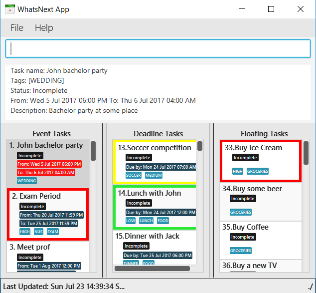

# WhatsNext - User Guide

By : `T01-T4`  &nbsp;&nbsp;&nbsp;&nbsp; Since: `Jun 2017`  &nbsp;&nbsp;&nbsp;&nbsp; Licence: `MIT`

---

1. [Quick Start](#1-quick-start)
2. [Features](#2-features)
3. [FAQ](#3-faq)
4. [Command Summary](#4-command-summary)

## 1. Quick Start

0. Ensure you have Java version `1.8.0_131` or later installed in your Computer. 

   > Having any Java 8 version is not enough.  
   > This app will not work with earlier versions of Java 8.

1. Download the latest `whatsNext.jar` from the [releases](../../../releases) tab.
2. Copy the file to the folder you want to use as the home folder for your Task Manager.
3. Double-click the file to start the app. The GUI should appear in a few seconds.
   > 

4. Type the command in the command box and press <kbd>Enter</kbd> to execute it.  
   e.g. typing **`help`** and pressing <kbd>Enter</kbd> will open the help window.
5. Some example commands you can try:
   * **`list`** : lists all tasks
   * **`add n/project meeting d/July 10 t/5-6`** adds an `Event` task to your task manager.
   * **`delete`**` 1` : deletes the 1st task shown in your current list
   * **`exit`** : exits the app
6. Refer to the [Features](#2-features) section below for details of each command. 

## 2. Features

> **Command Format**
>
> * Words in `UPPER_CASE` are the parameters.
> * Items in `SQUARE_BRACKETS` are optional.
> * Items with `...` after them can have multiple instances.
> * Parameters can be in any order.

> **Reserved Tags**
>
> * Reserved tag `HIGH`, `MEDIUM`, `LOW` names  are used to denote the importance of a certain task
> * Tagged task will be highlighted `RED`, `BLUE`, `GREEN`
> * Reserved tag `OVERLAP` are used to warn you about overlapping events.

### 2.1. Viewing help : `help`

Format: `help`

> Help is also shown if you enter an incorrect command e.g. `abcd` or the keyword `help`

### 2.2. Adding a task: `add`

Adds an (1) event, (2) deadline or (3) floating to the task manager 
Event must have a date, start time and end time. Event can overlap, but it will be tagged with the reserved tag `OVERLAP` to warn you.  
Deadline must have a date, but the end time could be optional. If it is specified, it will be by default 2359.  
Floating task do not have date or time.  

#### 2.2.1 Adding a event  
Format:  
* `add n/TASK_NAME d/DATE t/TIME [h/TAG]...`  
Examples:  
* `add n/project d/July 10 t/5-6 h/meeting`  

#### 2.2.2 Adding a deadline  
Format:  
* `add n/TASK_NAME d/DATE [t/TIME] [h/TAG]...`  
Examples: 
* `add n/project d/July 10 t/6 h/meeting`  

#### 2.2.3 Adding a floating  
Format:  
* `add n/TASK_NAME [h/TAG]...`  
Examples: 
* `add n/project h/meeting`

#### 2.2.4 Smart Add:  
Format:  
>`(1) add TASK_TYPE TASK_PARAMETERS`  

Examples: 
* `add event project meeting, July 10, 5-6`

##### Note:
> Tasks can have any number of tags (including 0)  
> TASK_TYPE **must match task type** (1) event, (2) deadline or (3) floating  
> TASK_PARAMETERS **must match task parameters of task type**

### 2.3. Listing tasks : `list`

Shows a list of (1) incomplete, (2) complete, (3) all tasks of the particular type in the task manager. 
Format:   
>`(1) list TASK_TYPE `  or  
&nbsp;&nbsp;&nbsp;&nbsp;&nbsp;&nbsp;&nbsp;`list TASK_TYPE /i` 
>`(2) list TASK_TYPE /c`  
>`(3) list TASK_TYPE /a`  

### 2.4. Editing a task : `edit`

Edits an existing task of a particular type in the task manager. 
Format: `edit TASK_TYPE INDEX [n/TASK_NAME] [d/DATE] [t/TIME]  [h/TAG]...`

> * Edits a task at the specified `INDEX`.
    The index refers to the index number shown in the last task listing. 
    The index **must be a positive integer** 1, 2, 3, ...
> * At least one of the optional fields must be provided.
> * Option fields **must match task type** (1) event, (2) deadline or (3) floating
> * Existing values will be updated to the input values.
> * When editing tags, the existing tags of the task will be removed i.e adding of tags is not cumulative.
> * You can remove all task's tags by typing `h/` without specifying any tags after it.

Examples:
* `edit event 1 d/July 10 t/5-10` 
  Edits the date and time of the 1st task (event) to be `July 10` and `5-10` respectively.

* `edit deadline 2 n/cs2103 submission meeting h/` 
  Edits the task name of the 2nd task (deadline) to be `cs2103 submission` and clears all existing tags.

### 2.5. Finding all tasks containing any keyword in their name or tags: `find`

Finds tasks whose names or tags contain any of the given keywords. 
Format: `find KEYWORD [MORE_KEYWORDS]`

> * The search is case insensitive. e.g `meeting` will match `Meeting`
> * The order of the keywords does not matter. e.g. `submission meeting` will match `submission meeting`
> * Only the name and tags are searched.
> * Only full words will be matched e.g. `meeting` will not match `meetings`
> * Tasks matching at least one keyword will be returned (i.e. `OR` search).
    e.g. `meeting` will match `submission meeting`

Examples:

* `find submission` 
  Returns `submission meeting` but not `submission`
* `find CS2103` 
  Returns Any person having tags `CS2103`

### 2.6. Deleting a task : `delete`

Deletes the specified task from the task manager. Irreversible. 
Format: `delete TASK_TYPE INDEX`

> Deletes the task at the specified `INDEX`.  
> The index refers to the index number shown in the most recent listing. 
> The index **must be a positive integer** 1, 2, 3, ...

Examples:

* `list event` 
  `delete event 2` 
  Deletes the 2nd incompleted event in the task manager.
* `find CS2103` 
  `delete TASK_TYPE 1` 
  Deletes the 1st task in the results of the `find` command.

### 2.7. View in detail : `view`

View a specific task in detail  
Format `view TASK_TYPE INDEX`  
Example:  
* `view event 1`
  View the 1 event in the task manager.

### 2.8. Undo last action : `undo`

Undo the last action performed by you. 
Format: `undo`

### 2.9. Clearing tasks : `clear`
Clears (1) incomplete, (2) complete, (3)all tasks in the task manager. 
Clears all entries of the same type from the task manager. 
Format: `clear TASK_TYPE MODIFYIER`
>`(1) clear TASK_TYPE /i`  
>`(2) clear TASK_TYPE `  or  
&nbsp;&nbsp;&nbsp;&nbsp;&nbsp;&nbsp;&nbsp;`clear /c` 
>`(3) clear TASK_TYPE /a`  

### 2.10. Marking tasks : `mark`
Mark the task at the specified `INDEX` to complete the task.  
Format: `mark TASK_TYPE INDEX`
> mark the task at the specified `INDEX`.  
> The index refers to the index number shown in the most recent listing. 
> The index **must be a positive integer** 1, 2, 3, ...
Examples:

* `list` 
  `mark event 2` 
  Marks the 2nd task in the task manager.
* `find CS2103` 
  `mark TASK_TYPE 1` 
  Marks the 1st task in the results of the `find` command.

### 2.11. Marking tasks : `unmark`
Unmark the task at the specified `INDEX`.  
Format: `unmark TASK_TYPE INDEX`
> Unmark the task at the specified `INDEX`.  
> The index refers to the index number shown in the most recent listing. 
> The index **must be a positive integer** 1, 2, 3, ...
Examples:

* `list floating ` 
  `unmark floating 2` 
  Unmarks the 2nd task in the task manager.
* `find CS2103` 
  `unmark TASK_TYPE 1` 
  Unmarks the 1st task in the results of the `find` command.

### 2.12. View current data file path : `viewPath`

View data file directory path.  
Format: `viewPath`
> View the directory where the data file is saved  

### 2.13. Updating data file

Updates data file directory. : `updatePath` 
Format: `updatePath [Path Directory]`
> Updates the directory where the data file is saved  
Task Manager data are saved in the specified path directory. 

### 2.14. Saving the data

Task Manager data are saved in the hard disk automatically after any command that changes the data. 
There is no need to save manually.

### 2.15. Exiting the program : `exit`

Exits the program. 
Format: `exit`

## 3. FAQ

**Q**: How do I transfer my data to another Computer? 
**A**: Install the app in the other computer and overwrite the empty data file it creates with
       the file that contains the data of your previous Task Manger folder.

## 4. Command Summary

Function | Format | Examples
-------- | ------ | --------
Get Help infomation | `help` |
Add a event | `add n/TASK_NAME d/DATE t/TIME [h/TAG]...`   `add event n/TASK_NAME d/DATE t/TIME [h/TAG]...` | `add n/Project metting d/July 5 t/18-20`
Add a deadline | `add n/TASK_NAME d/DATE [t/TIME] [h/TAG]...`   `add deadline n/TASK_NAME d/DATE [t/TIME] [h/TAG]...` | `add n/Project submission d/July 5 t/20`
Add a floating | `add n/TASK_NAME [h/TAG]...`   `add floating n/TASK_NAME [h/TAG]...`| `add n/CS2103 exam h/HIGH`
List all task/floating/deadline/event | `list /a` `list floating /a`  `list deadline /a`  `list event /a` |
List incomplete task/floating/deadline/event | `list /i` `list floating /i` `list deadline /i`  `list event /i` |
List complete task/floating/deadline/event | `list /c` `list floating /c` `list deadline /c`  `list event /c` |
Clear all task/floating/deadline/event | `clear /a` `clear floating /a`  `clear deadline /a`  `clear event /a` |
Clear incomplete task/floating/deadline/event | `clear /i` `clear floating /i`  `clear deadline /i`  `clear event /i` | 
Clear complete task/floating/deadline/event | `clear /c` `clear floating /c`  `clear deadline /c`  `clear event /c` |
Edit floating/deadline/event | `edit floating INDEX [n/TASK_NAME] [d/DATE] [t/TIME]  [h/TAG]`    `edit deadline INDEX [n/TASK_NAME] [d/DATE] [t/TIME]  [h/TAG]`    `edit event INDEX [n/TASK_NAME] [d/DATE] [t/TIME]  [h/TAG]` | `edit event 1 h/HIGH`
Delete floating/deadline/event | `delete floating INDEX`   `delete deadline INDEX `   `delete event INDEX ` | `delete event 1`
Find by keywords or tags | `find KEYWORD [MORE_KEYWORDS]` | `find CS2103 Exams`
Undo the last action | `Undo` |
Mark incomplete floating/deadline/event as completed | `mark floating INDEX`  `mark deadline INDEX`  `mark event INDEX` | `mark event 1`
Unmark completed floating/deadline/event as incomplete | `unmark floating INDEX`  `unmark deadline INDEX`  `unmark event INDEX` | `unmark event 1`
View floating/deadline/event | `view floating INDEX`   `view deadline INDEX `   `view event INDEX ` | `view event 1`
ViewPath of the storage file | `viewPath` |
Change the path of the storage file | `updatePath [path_directory]` | `updatePath C:\User\tasks.xml`
Exit the programme | `exit` |
